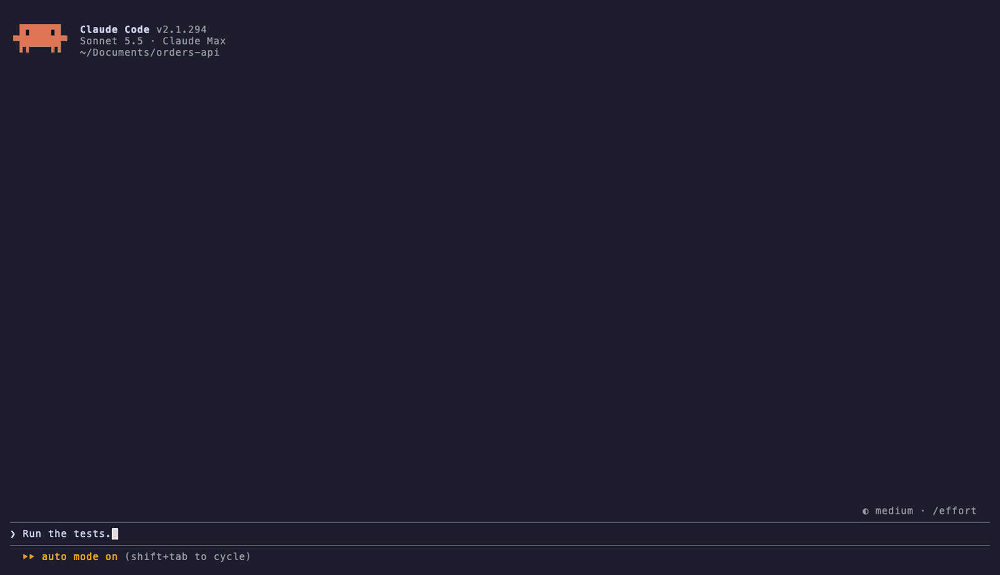

# pass-or-bust

**Slots for your test runs. The reels are rigged. By your test suite.**

I bet against my own AI's tests. The house always wins. Except when it's 0.1 + 0.2.



A Claude Code mod that turns every test run into a slot machine. You bet fake
credits on pass or fail, the reels spin while the tests run, and the run's real
result settles it. The house collects its five percent like it has every right
to.

Fake credits only. No real money, no network calls, no model calls. The only
thing at stake is your dignity.

## Pull the lever

> The reels are rigged. By your test suite.

The reels are decoration: they always stop on the result your tests actually
produced. Nothing about a spin is random, and the reels decide nothing.

1. Claude runs the tests. Three reels start spinning above the prompt, with the
   command, the time it has been running, the odds and a word from the house.
2. Type **`1`** (pass) or **`2`** (fail) at an empty prompt to stake $100. No
   focusing, no menus. The tests are already running: betting never holds them
   up, and if you do not bet, nothing is wagered.
3. The run finishes. The reels slow down and stop left to right on what really
   happened: `✓ ✓ ✓` for a pass, `✕ ✕ ✕` for a fail, a mixed line and
   `REFUNDED` for a run that never finished. The third reel takes its time,
   and lingers on the wrong symbol first.

   When you have a bet on, the house holds the result up to 2.5 seconds so the
   reels can stop first. It never changes the result. With no bet, nothing is
   held.
4. Bet and won? The tally rolls in (`stake $100  x  x2.85  =  $285`), the coins
   pile up, and `CASHED OUT` lands in block letters with a coin sound. Lost?
   `BUSTED`, and a sad trombone. Then the band goes back to the market for the
   next run.
5. Missed the window? After a run the band offers the next one. A bet placed
   between runs stands for the next run and can be cancelled until it starts.
   Between runs Claude usually leaves a suggestion in the prompt, where a digit
   would go, so press **ctrl+x tab** first, then `1` or `2`. A standing bet
   cancels the same way: **ctrl+x tab**, then `c`.

`/bankroll` opens the ledger: a chart of your bankroll over the last fifteen
bets (gold above the starting $1,000, orange below; a narrow dock keeps the
latest that fit), your rank, lifetime P&L,
win rate, this project's pass rate, best streak, bailouts and the last bets.
Ranks run from *Fresh meat* through *Intern gambler* and *Card counter* to
*The House*. Go broke and the band offers a bailout back to $1,000
(**ctrl+x tab**, then `b`). The ledger counts those, forever.

The bankroll, an open bet and each project's record persist across sessions.

Every outcome is told in a glyph and a word as well as a color (`✓ PASS`,
`✕ FAIL`, `▴` for a win, `▾` for a loss), and the colors come from a palette
that reads for the common kinds of color blindness.

The reels need about thirteen rows above the prompt and eighty columns. In a
smaller band the mod draws a compact market instead: the same odds, bets and
payouts, without the machine.

## Install

Requires Claude Code 2.1.287 or later (mods). Developed and tested on 2.1.292.
The house is designed for a dark Claude Code theme; on a light theme some text is hard to read.

```
/plugin marketplace add ilovepixelart/pass-or-bust-mod
/plugin install pass-or-bust@pass-or-bust-mod
/reload-plugins
```

That follows the latest release on `main`. To stay on one release instead,
add the marketplace at its tag:

```
/plugin marketplace add ilovepixelart/pass-or-bust-mod#pass-or-bust--v0.1.0
```

To take a new release later, run `claude plugin update pass-or-bust@pass-or-bust-mod`
in your shell. Each [release](https://github.com/ilovepixelart/pass-or-bust-mod/releases)
also carries a zip of the plugin for `claude --plugin-url`, and
[CHANGELOG.md](CHANGELOG.md) lists what each one changed.

To try it from a clone without installing: `claude --plugin-dir /path/to/pass-or-bust-mod`.

## Versioning

Releases follow [Semantic Versioning](https://semver.org/). While the version
is 0.x, any release may change behaviour. The bankroll is saved in a
versioned store layout: a release never reads or overwrites a store saved in
a newer layout than it knows, and says so instead.

## How the house sets the odds

[`oddsOf`](hooks/odds/odds-of.ts) prices each side from the project's settled
runs, kept per working directory. The chance of a pass is
`(passes + 1) / (runs + 2)`, so a brand new project is a coin flip. Each side
pays `0.95 / chance` per credit: the fair price less a 5% house edge, rounded
down to the cent and held between 1.01 and 50.

With no history both sides pay x1.90. After three passes and a fail, pass pays
x1.42 and fail pays x2.85. The constants live in
[`hooks/limits/limits.ts`](hooks/limits/limits.ts).

## What counts as a test run

A Bash command with a step that starts with a known runner (`npm test`,
`pnpm test`, `bun test`, `pytest`, `uv run pytest`, `go test`, `cargo test`,
`vitest`, `jest`, `make test` and friends; the full table is
[`hooks/detect/runners.ts`](hooks/detect/runners.ts)). Leading `NAME=value`
assignments and earlier steps (`cd app && npm test`) are fine.

The house never changes what Claude runs. How a run settles depends on how
Claude ran it:

- **Unpiped, the exit code settles it.** 0 is a pass, anything else a fail.
- **Piped through `tail`, `tee` or `cat`, the summary settles it.** In
  `bun test 2>&1 | tail -30` the exit code is `tail`'s, so the house reads the
  runner's own summary line instead (`1 pass` / `1 fail`, `Tests: 1 failed`,
  `test result: FAILED`, `===== 1 failed, 1 passed =====` and so on). It reads
  bun, deno, go, cargo, pytest, jest and vitest; the readers are in
  [`hooks/summary/summary-of.ts`](hooks/summary/summary-of.ts), tested against
  real output from each runner. A summary it cannot find whole (cut short by
  `tail -2`, missing, or two runners disagreeing) makes the bet void, never a
  guess.
- **Piped into anything else, no market opens.** `head` drops the summary and
  `grep` keeps whatever it likes, so the house cannot settle those honestly.
- **Background runs open no market**, since their result arrives later.
- **A run that never finishes** (interrupted, timed out, refused) is void, and
  the stake comes back.

## Access

What `claude plugin validate .` reports the module calls, and why:

- `$.store`: the store layout version, the bankroll, an open bet and each
  project's pass and fail counts.
- `$.state`, `$.ui.open`, `$.ui.resolve`, `$.command.register`: the band and `/bankroll`.
- `$.ui.toast`: the settlement line.
- `$.clock.now`, `$.clock.after`: how long a run took, and taking the show down
  three and a half seconds after the stamp lands.
- `$.audio.play`: the coin and the trombone (`sounds/coin.wav`,
  `sounds/trombone.wav`), played from the mod's own folder.

The animation (the reels, the run timer, the tally, the stamp and the chart
drawing in) runs in four surface modules under `hooks/clients/`, on the
drawing's own frame clock: they take plain data from the hooks module and
reach nothing else.

No file system, process, network or model access. The `tool.call` hook only
watches Bash and always hands back the tool's own result unchanged; if the
hook fails, its `.catch` lets the call through.

## Development

```sh
node scripts/check-release.mjs
claude plugin validate --strict .
claude plugin test .
npx -p typescript tsc -p .
```

To release, add the version's section to `CHANGELOG.md`, set the version in
`.claude-plugin/plugin.json` (its only home), merge, then run
`claude plugin tag --push` on `main`. The pushed `pass-or-bust--v<version>`
tag starts the release workflow, which checks everything again and creates
the GitHub release.

`tsc` needs the type declarations Claude Code writes into
`.claude-plugin/types/` when it loads the plugin; any `claude --plugin-dir .`
run writes them, even one that stops at "Not logged in" (CI does exactly
that). The sounds are synthesized: `python3 scripts/make_sounds.py sounds`
regenerates both. The runner output the summary readers are tested against is
captured from real runs: `python3 scripts/capture_runner_output.py <scratch-dir>`
rewrites `tests/fixtures/runner-output.ts` (pytest runs through `uvx`, jest and
vitest through `npx`). The demo is recorded with
[vhs](https://github.com/charmbracelet/vhs) in a scratch project.

## License

MIT
